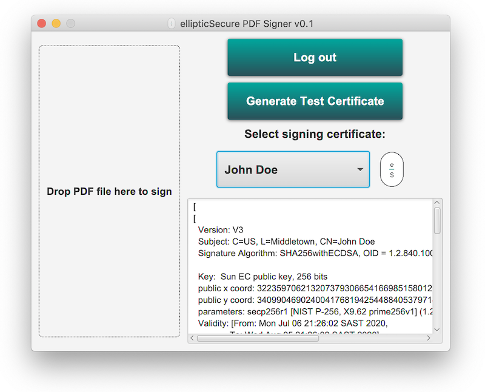
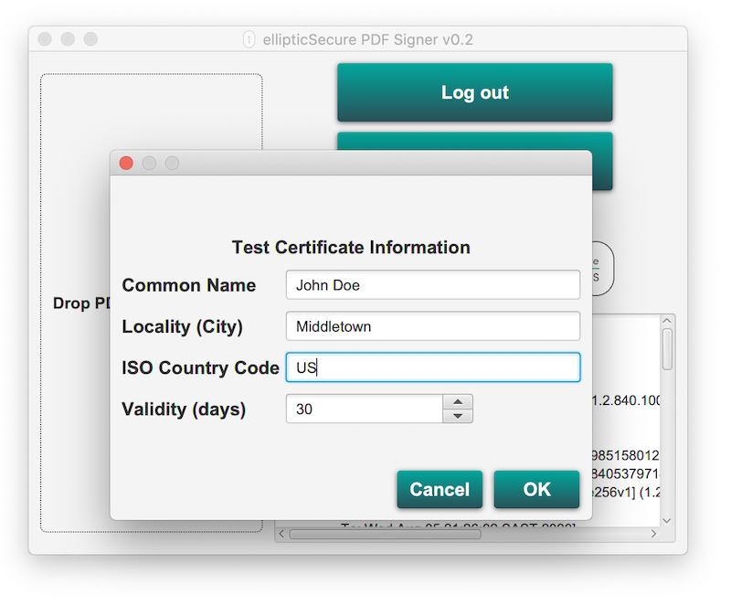

### This example demonstrates how to use MIRkey or eHSM Hardware Security Modules to sign a PDF file

#### Prerequisites: 
 * Initialized MIRkey or eHSM with a user PIN set.
 * Java 9 or later to build.
 * Java 8 or later with JavaFx required to run.
 
#### Test instructions
1. ```bash
   mvn package
   ```
2. ```bash 
   java -jar target/signer-app-0.0.2-SNAPSHOT-jar-with-dependencies.jar
   ```
3. If you do not have a certificate on your device, use the "Generate Test Certificate" button to test. 
##### Note: You may need to set the EHSM_LIBRARY environment variable if your libehsm.so/dylib/dll is not in a standard location.

### Some screenshots of the sample app

#### Main screen


#### PIN entry


#### Logged in


#### Test certificate creation


#### PDF signed


